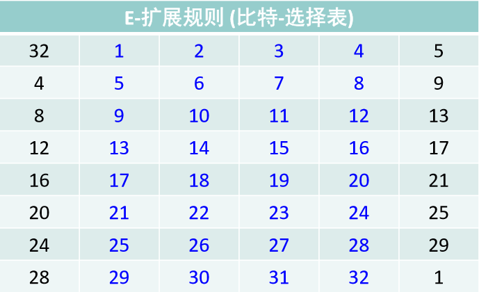

# DES 算法的程序设计和实现

[toc]

## DES算法

### Introduction

> DES（数据加密标准）算法是世界上使用最广泛的加密算法。它是美国1977年采用的一种用于电子数据加密的对称密钥算法。
>
> DES是典型的块密码——一种采用固定长度的明文位串并通过一系列复杂的操作将其转换成另一个相同长度的密文位串的算法。对于DES，块大小为64位。DES还使用一个密钥来定制转换，这样就可以假定只有那些知道用于加密的特定密钥的人才能执行解密。
>
> DES是Feistel密码的实现。 它采用16轮Feistel结构。 块大小为64位。 尽管密钥长度为64位，其中只有56个被算法实际使用。8位仅用于校验奇偶校验，然后被丢弃。因此，有效密钥长度为56位。
>
> 它使用了一个56位的密钥，这在今天被许多人认为是不够的，因为它可以通过蛮力破解。尽管从一开始就批评它的56位短密钥长度使它对于大多数当前应用程序来说都不安全，但是它对现代密码学的发展具有很大的影响力。

### Overall structure

在加密站点，DES接受64位明文并创建64位密文;

在解密站点，DES接受64位的密文并创建64位的明文块。加密和解密都使用相同的56位密码密钥。


加密过程由两种排列(p -box)，我们称之为初始排列和最终排列，以及16轮Feistel排列组成。每一轮都使用一个不同的48位子密钥，该密钥是根据预加密算法从密码密钥生成的。下图显示了加密站点的DES密码元素。


​	从上图我们可以看到，DES算法中基于Feistel密码，所以要确定DES，就要先确定

 -  迭代 Round

 -  密钥调度

 -  初始置换和逆置换

    

### Characteristics Overview

- DES 是一种典型的块加密方法：它以64位为分组长度，64位一组的明文作为算法的输入，通过一系列复杂的操作，输出同样 64位长度的密文。
- DES 使用加密密钥定义变换过程，因此算法认为只有持有加密所用的密钥的用户才能解密密文。 
- DES 采用64位密钥，但由于每8位中的最后1位用于奇偶校验， 实际有效密钥长度为56位。密钥可以是任意的56位的数，且可 随时改变。其中极少量的数被认为是弱密钥，但能容易地避开 它们。所有的保密性依赖于密钥。 
- DES 算法的基本过程是换位和置换。

### Module Decomposition

#### Byte padding

 原始明文消息按PKCS#5 (RFC 8018) 规范进行**字节填充**

- 原始明文消息最后的分组**不够8个字节(64位)**时，在末尾以**字节填满**，填入的字节**取值相同**，都是**填充的字节数**
- 原始明文消息刚好分组完全时，在末尾填充8个字节(即**增加一个完整分组**)，每个字节**取值都是08**


####   Initial and Final Permutations 

- 初始置换

  给定64位明文块M，通过一个固定的初始置换IP重排M中的二进制位，得到二进制串
  $$
  M_0= IP(M) = L_0R_0
  $$
  这里 L<sub>0 </sub>和 R<sub>0</sub> 分别是 M<sub>0</sub>  的前32位和后32位。

- 逆置换

  对迭代T输出的二进制串R16L16 使用初始置换的逆置换IP-1 得到 密文C，即
  $$
  C = IP^{-1}(R_{16}L_{16})
  $$
  

  这两种排列在DES中没有密码学意义，它们都是无密钥的、预先确定的。例如，在初始排列中，输入中的第58位成为输出中的第1位。同样，在逆置换（排列）中，输入中的第1位变成了输出的第58位。换句话说，如果这两个排列之间的迭代T不存在，那么进入初始排列的第58位与离开最终排列的第58位是相同的

  


#### Rounds 

DES用16轮迭代，每一轮都是一个Feistel（ 分组密码中的一种对称结构 ）密文

##### 迭代T 

根据  L<sub>0</sub> R<sub>0</sub> 按下述规则**进行16次迭代**T<sub>1</sub>, T<sub>2</sub> , …, T<sub>16</sub>，即
$$
L_i = R_{i-1}\\
R_i = L_{i-1} \oplus f(R_{i-1},K_i)
$$
16个长度为48位的子密钥  K<sub>i</sub>  (i= 1 .. 16) 由密钥K生成

16次迭代后得到 L<sub>16</sub>  R<sub>16</sub>

<table>
    <tr>
        <td><center></center></td>
        <td><center></center></td>
    </tr>
</table>

最后左右交换输出  R<sub>16</sub> L<sub>16</sub>

可以看到，在上面的两个密码元素 交换（图中的Swapper） 和 异或（图中的Mixer） 中，交换明显是可逆的，它将 输入的左半部分与右半部分互换，而 异或 肯定也是可逆的。所以所有不可逆的元素都集中在轮函数 f(R<sub>i-1</sub> , K<sub>i</sub>) 中

##### Feistel轮函数 f ( R<sub>i-1</sub>, K<sub>i</sub>) 

步骤：

1. 将长度为32位的串 R<sub>i-1</sub> 作 **E-扩展**，成为48位的串 E(R<sub>i-1</sub>)
2. 将 E(R<sub>i-1</sub>) 和长度为48位的子密钥 K<sub>i</sub> 作48位二进制串按位**异或**运算，K<sub>i</sub> 由密钥K生成
3. 将 (2) 得到的结果平均分成8个分组，每个分组长度6位。各个分组分别经过**8个不同的S-盒**进行**6-4 转换**，得到8个长度分别为4位的分组
4. 将 (3) 得到的分组结果 **顺序连接** 得到长度为32位的串
5. 将 (4) 的结果经过 **P-置换**，得到的结果作为**轮函数 f(R<sub>i-1</sub>, K<sub>i</sub>) **的最终32位输出


-  Expansion D-box 

  由于 R<sub>i-1</sub> 是32位输入，K<sub>i</sub> 是48位密钥，我们首先需要将 R<sub>i-1</sub> 扩展到48位。这种扩展排列遵循一个预先确定的规则。对于每个部分，分别将输入第1、2、3和4位复制到输出第2、3、4和5位。输出第1位来自上一节的第4位;输出第6位来自下一节的第1位。

  <table>
      <tr>
          <td><center></center></td>
      </tr>
      <tr>
          <td><center></td>
      </tr>
  </table>

-  S-Boxes 

   S盒进行真正的混合（混淆）。 DES使用 **8个S-box**，每个都有6位输入和4位输出。

   将在操作（2）之后所获得的 **48位数据** 分为 **8个6位数据块**，每个数据块都被送入一个盒子中。每个S-box 是一个4行(编号0-3)、16 列(编号0-15) 的表，表中的每个元素是一个十进制数，取值在 0-15 之间，用于表示一个4位二进制数。 

   - example

     假设Si 的6位输入为 **b<sub>1</sub>b<sub>2</sub>b<sub>3</sub>b<sub>4</sub>b<sub>5</sub>b<sub>6</sub>**，则由 **n= (b<sub>1</sub>b<sub>6</sub>)<sub>10</sub>**  确定行号，由 **m= (b<sub>2</sub>b<sub>3</sub>b<sub>4</sub>b<sub>5</sub>)<sub>10</sub> ** 确定列号，**[S<sub>i</sub>]<sub>n,m</sub> **元素的值的**二进制形式**即为所要的Si 的输出。

   

-  Final  Permutation 

   轮函数的最后一步还是一个 **32位输入 32位输出** 的 P - 置换

   


#### Key Generation


子密钥生成过程根据给定的64位密钥K，**生成16个48位的子密钥K<sub>1</sub> -K<sub>16</sub>**，供Feistel轮函数f(R<sub>i-1</sub>, K<sub>i</sub>) 调用 

1.  对K的56个**非校验位**实行**置换PC-1**，得到C<sub>0</sub>D<sub>0</sub>，其中 C<sub>0</sub> 和 D<sub>0</sub> 分别由PC-1置换后的前28位和后28位组成

   

2. 计算
   $$
   C_{i} = LS_{i}(C_{i-1})\\
   D_{i} = LS_{i}(D_{i-1})
   $$
   当 i=1, 2, 9, 16 时，LS<sub>i</sub>(A) 表示将二进制串A**循环左移**一个位置；否则**循环左移**两个位置

3. 对56位的 C<sub>i</sub>D<sub>i</sub>  实行 **PC-2 压缩置换**，得到48位的 K<sub>i</sub>，i = i+1。 

   PC-2 压缩置换 是一个 **56位输入 48位输出** 的置换，从56位的 C<sub>i</sub>D<sub>i</sub> 中去掉第9, 18, 22, 25, 35, 38, 43, 54位，将剩下的48位按照PC-2 置换表作置换

   

4.  如果已经得到**K<sub>16</sub>**，密钥调度过程结束；否则转(2)


####   Cipher and Reverse Cipher 

前面我们已经讨论过了，**迭代 T 中的 交换 和 异或 都是可逆的**，而在密钥确定的情况下，K<sub>1</sub>……K<sub>16</sub> 都是确定的，所以我们可以推导

Encrypt：
$$
L_{i} = R_{i-1}\\
R_{i} = L_{i-1}\oplus f(R_{i-1},K_{i})
$$
那么 Decrypt 就是
$$
R_{i-1}=L_{i}\\
L_{i-1}=R_{i}\oplus f(R_{i-1},K_{i})\\
L_{i-1}=R_{i}\oplus f(L_{i},K_{i})
$$
整理得：
$$
L_{i}=R_{i+1}\oplus f(L_{i+1},K_{i+1})\\
R_{i}=L_{i+1}
$$
是否觉得 加密和解密 有点像，其实就是**（形式上）L 和 R 换了过来**，但是我们知道在加密过程中**迭代T的最后一步** L<sub>16</sub> 和 R<sub>16</sub>已经交换过一次，所以**解密**的时候**一开始相当于 L 和 R 已经交换过**了，所以可以**直接进行迭代**，当然，最后要记得将它们**交换回来**（形式上相同不代表真的相同），所以加密和解密的过程大致一样，只有传入 子密钥 的顺序发生变化，加密是K<sub>1</sub>……K<sub>16</sub>，而解密是K<sub>16</sub>……K<sub>1</sub>


### Source Code

具体代码文件**在附件中给出**

一开始看到这么多位操作时，第一反应是用 bitset 来做，但是写着写着发现，bitset 的位处理好像有点麻烦，因为bitset的索引（下标）是从低位往高位存储的，而输出（to_string）是从高位往低位的，感觉好像直接全部用string来处理也还行。所以我写了**两个cpp文件，一个使用 bitset 实现的，一个是 string 实现的**

bitset版

Subkey generator

```c++
void getSubKey(bitset<64> Key)
{
	//PC1 Permutation
	bitset<56> afterPC1 = PC1Replace(Key);
	
	bitset<28> C0(afterPC1.to_string().substr(0, afterPC1.size() / 2));
	bitset<28> D0(afterPC1.to_string().substr(afterPC1.size() / 2, afterPC1.size() / 2));
	
	for (int i = 0; i < 16; i++)
	{
        //shifted left (circular shift) one or two bits
		bitset<28>newC = C0 << LeftShift[i] | C0 >> (28 - LeftShift[i]);
		bitset<28>newD = D0 << LeftShift[i] | D0 >> (28 - LeftShift[i]);
        //PC2 Permutation
		SubKey[i] = PC2Replace(bitset<56>(newC.to_string() + newD.to_string()));
		C0 = newC;
		D0 = newD;
	}
}
```

加密/解密主体

```c++
string EncryptOrDecrypt(string plain_text, bitset<64> Key, bool Encrypt)
{
    //Byte padding
	if (Encrypt) fillData(plain_text);

	int block_num = plain_text.length() / 8;

	string cipher;
    //subkey generator
	getSubKey(Key);
    //Divided into several blocks
	for (int i = 0; i < block_num; i++)
	{
        //initial permutation
		bitset<64> M0 = IPReplace(string2bit(plain_text.substr(8 * i, 8)));

		bitset<32> Li_1(M0.to_string().substr(0, M0.size() / 2));
		bitset<32> Ri_1(M0.to_string().substr(M0.size() / 2, M0.size() / 2));
		bitset<32> Li;
		bitset<32> Ri;
		//16 rounds
		for (int i = 0; i < 16; i++)
		{
			Li = Ri_1;
			Ri = Li_1 ^ getFeistel(EExpand(Ri_1), (Encrypt ? SubKey[i] : SubKey[15 - i]));

			Ri_1 = Ri;
			Li_1 = Li;
		}
		bitset<64> after_W(Ri.to_string() + Li.to_string());
        //final permutation
		cipher += IPRelpace_Inverse(after_W).to_string();
	}

	return cipher;
}
```

string版

Subkey generator

```c++
void getSubKey(string Key)
{
    //PC1 Permutation
	string afterPC1 = PC1Replace(Key);

	string C0(afterPC1.substr(0, afterPC1.length() / 2));
	string D0(afterPC1.substr(afterPC1.length() / 2, afterPC1.length() / 2));

	for (int i = 0; i < 16; i++)
	{
		strLeftShift(C0, LeftShift[i]);
		strLeftShift(D0, LeftShift[i]);
		//PC2 Permutation
		SubKey[i] = PC2Replace(C0 + D0);
	}
}
//shifted left (circular shift) one or two bits
void strLeftShift(string &cur, int num)
{
	for (int i = 0; i < num; i++)
	{
		cur = cur.substr(1, cur.length() - 1) + cur[0];
	}
}
```

加密/解密主体

```c++
string EncryptOrDecrypt(string plain_text, string Key, bool Encrypt)
{
    //Byte padding
	if (Encrypt) fillData(plain_text);

	int block_num = plain_text.length() / 8;

	string cipher;
    //Subkey generator
	getSubKey(Key);
	//Devided into several blocks
	for (int i = 0; i < block_num; i++)
	{
        //Initial permutation
		string M0 = IPReplace(string2bit(plain_text.substr(8 * i, 8)));

		string Li_1(M0.substr(0, M0.length() / 2));
		string Ri_1(M0.substr(M0.length() / 2, M0.length() / 2));
		string Li;
		string Ri;
		//16rounds
		for (int i = 0; i < 16; i++)
		{
			Li = Ri_1;
			string temp = getFeistel(EExpand(Ri_1), (Encrypt ? SubKey[i] : SubKey[15 - i]));
			Ri = XOR(Li_1, temp);

			Ri_1 = Ri;
			Li_1 = Li;
		}
        //final permutation
		cipher += IPRelpace_Inverse(Ri + Li);
	}

	return cipher;
}
```

其实两者区别不大，就是bitset写成了string，但是bitset本身也可以用string构造，只是位操作更方便。


### Result

- 输入：

  0 表示加密    1表示解密

  64位密钥要是以bit形式输入

  明文以string的方式读取，再将ascii转为bitset进行加密

  **代码中给出了 所有的进制/string to bit/bit to string的转换，限于简化输入，没有在main中调用**

- 输出：

  加密之后的 bits（如果上面的输入是解密的话，则没有该输出）

  以及利用这个 bits 进行解密的输出

  

  由于忘记最后加个system.pause() / getchar() 暂停，所以如果直接运行exe文件的话，将输出重定向到文件中

  ```shell
  DES_string > out.txt
  ```