# MD5 算法的程序设计和实现

[toc]

[Github项目地址]( https://github.com/wywwwwei/InformationSecurity/tree/master/HW2)

## MD5算法

### Introduction

> MD5消息摘要算法是一个广泛使用的散列函数，它==产生一个128位的散列值==。 尽管MD5最初被设计为用作加密哈希函数，但它被发现存在大量漏洞，不过仍然可以用作校验和，以验证数据的完整性，但只能防止意外损坏。 它仍然适用于其他非加密目的，例如，确定分区数据库中特定密钥的分区。
>
> MD5哈希算法是一种单向加密功能，该算法的思想是采用随机数据(文本或二进制)作为输入，并生成固定大小的“散列值”作为输出。它==接受任意长度的消息作为输入==，但是输出返回的是固定长度的摘要值，以用于认证原始消息。
>
> 任何加密哈希函数的一个基本要求是，在计算上不可能找到两个哈希值相同的不同消息。MD5无法满足这一要求;在一台普通的家用电脑上，这种碰撞几秒钟就能发现。
>
> MD5算法适用于数字签名应用，其中大文件必须先以安全的方式“压缩”，然后才能在诸如RSA之类的公钥密码系统下使用私钥（秘密）进行加密。

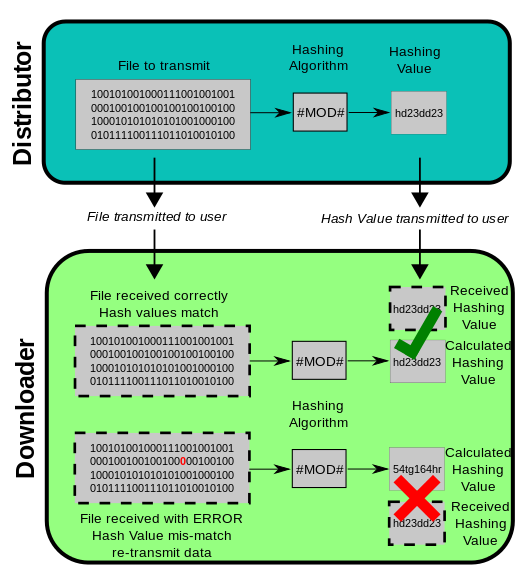

### Overall structure

输入：任意长度的消息

输出：固定 128-bits 的摘要信息

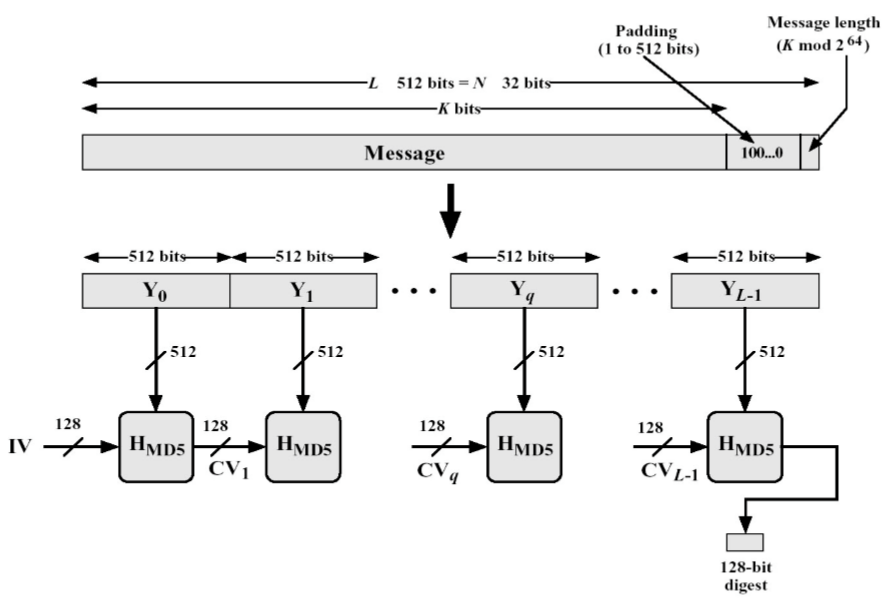

MD5 算法的基本过程为：填充、分块、缓冲区初始化、循环压缩、得出结果

### Characteristics Overview

Advantage and disadvantage

> MD5算法很有用，因为与存储可变长度的大文本相比，比较和存储这些较小的哈希值更容易。 MD5算法是一种广泛使用的用于单向哈希的算法，用于验证而不必给出原始值。Unix系统使用MD5算法以128位加密格式存储用户密码。 MD5算法广泛用于检查文件的完整性。
> 而且，使用该算法很容易生成原始消息的消息摘要，可以执行任意位数的消息的消息摘要。
> 但是多年来，MD5容易出现哈希冲突弱点，即可以为两个不同的输入创建相同的哈希函数。 MD5对这些冲突攻击没有提供任何安全性。 SHA（Secure Hash Algorithm，可产生160位消息摘要，由NSA设计为数字签名算法的一部分）现已取代MD5。现在可以接受在密码字段生成哈希函数,因为它是不容易产生SHA-I碰撞,直到现在还没有产生碰撞。

### Module Decomposition

#### Append Padding Bits

在长度为K bits 的原始消息数据尾部填充长度为P bits 的标识 100…0，1 <= P <= 512 (即==至少要填充1个bit==)，使得填充后的消息位数为：==K + P ≡ 448 (mod 512)==. 注意到当K ≡ 448 (mod 512) 时，需要P= 512. 

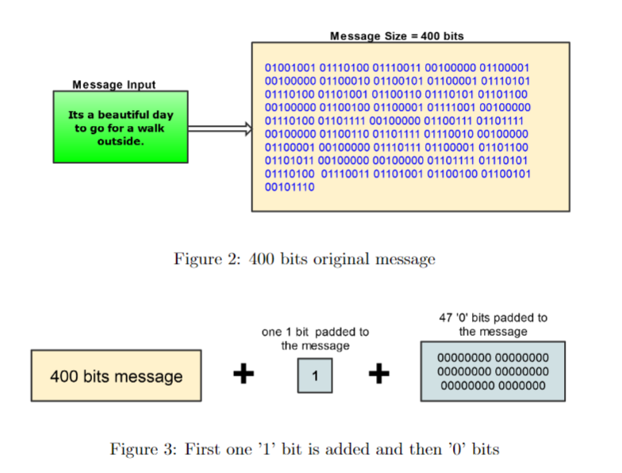

如上图，如果我们的消息是400位，那么我们将添加一个“1”位和47个“0”位，这样就得到448位，比512少64位。如果我们的消息的大小是1200位，那么我们将添加一个“1”位和271“0”位，得到1472位。1472+64能被512整除。将至少1位和最多512位填充(或扩展)到原始消息

#### Append Length

在填充之后，我们获取原始消息K并在上述填充好的消息末尾插入64位，用来记录原始输入的长度。现在消息的长度正好可以被512整除，即 ==K + P+ 64 ≡ 0 (mod 512)==

把填充后的消息结果分割为L个512-bit 分组：Y<sub>0</sub>，Y<sub>1</sub>，Y<sub>2</sub>，Y<sub>3</sub>，……，Y<sub>L-1</sub>

再将分组结果表示成N个32-bit 字M<sub>0</sub>， M<sub>0</sub>，…… ，M<sub>N-1</sub> （N= L*16）

#### Initialize MD buffer

128-bit缓冲区（A，B，C，D）用于计算消息摘要的值。这里的A，B，C，D是32位寄存器，并按以下方式（采用小端存储(little-endian) 的存储结构）初始化

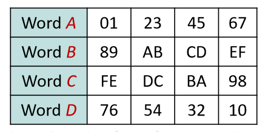

> Little-Endian 将低位字节排放在内存的低地址端，高位字节 排放在内存的高地址端。相反Big-Endian 将高位字节排放 在内存的低地址端，低位字节排放在内存的高地址端。存 储结构与CPU 体系结构和语言编译器有关。PowerPC 系列 采用Big Endian 方式存储数据，而Intel x86系列则采用Little Endian 方式存储

#### Processing message in 16-word block

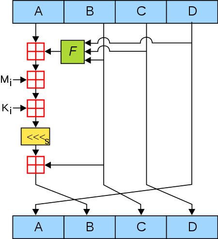

#####  Auxiliary Functions 

辅助函数接受三个32位的输入，然后给出一个32位的输出。辅助函数将逻辑and、or和xor应用于输入，是一个32位非线性逻辑函数。稍后我们将展示如何在4轮循环中使用这4个函数（作为生成函数/轮函数）(每轮有16个操作)。这些辅助函数的功能是

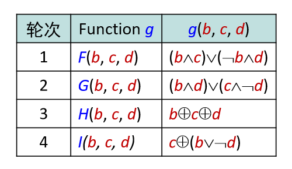

#####  The Table

T表的生成
$$
T[i]=int(2^{32}*|sin(i)|)
$$
int取整函数，sin正弦函数，以i作为弧度输入

我们将该表表示为K [1 ..... 64]。 K [i]是表格的第i个元素。 该表的元素已预先计算

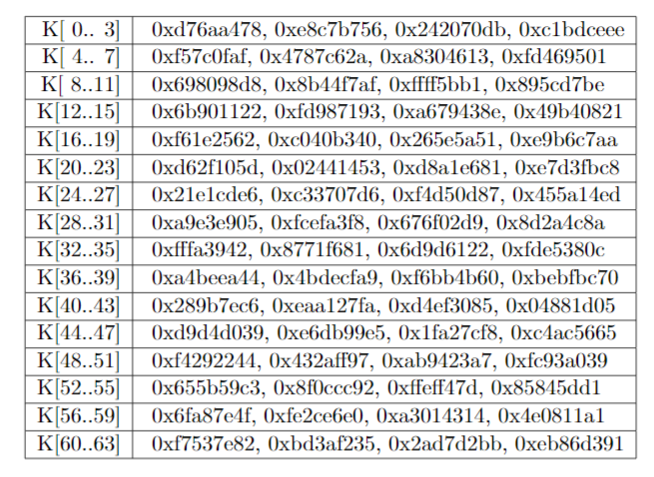

#####  The Algorithm

算法流程：

以512-bit 消息分组为单位，每一分组Y<sub>q</sub>> (q= 0, 1, …, L-1) 经过4 个循环的压缩算法，表示为： 
$$
CV_{0}=IV\\
CV_{i}=H_{MD5}(CV_{i-1},Y_{i})
$$
输出结果：$MD=CV_{L}$

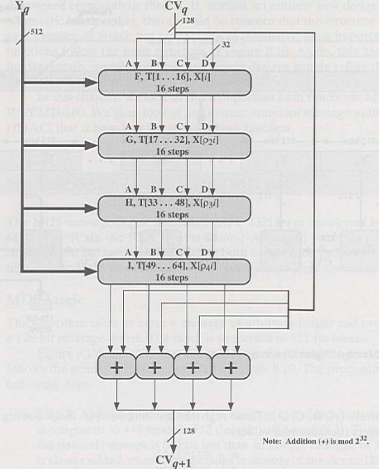

回想一下步骤2，我们将消息分成512位的块，然后每个512位的块是16个32位的字。这16个字(每个32位)块表示为M[0…N-1]。现在，对于每个字块，我们执行4轮，每轮有16个操作。每一轮都遵循基本模式。

每轮循环中的一次迭代运算逻辑：

(1) 对A迭代：a <---- b+ ((a+ g(b, c, d) + X[k] + T[i]) <<<s) 

(2) 缓冲区(A, B, C, D) 作循环轮换： 

​	(A, B, C, D)  ---> (D, A, B, C)

> 说明：
>
> - a, b, c, d： MD 缓冲区(A, B, C, D) 的当前值
> - g：轮函数(F, G, H, I中的一个)
> - <<<s：将32位输入循环左移(CLS) s位；s 为规定值
> - X[k]： 当前处理消息分组q 的第k个(k= 0...15) 32位字，即 M<sub>q*16+k</sub>
> - T[i]：T 表的第i个元素，32位字；T表总共有64个元素，也称为加法常数
> - \+ ：模2<sup>32</sup> 加法

- 压缩函数H<sub>MD5</sub>

  - HMD5 从CV输入128位，从消 息分组输入512位，完成4轮 循环后，输出128位，用于下 一轮输入的CV值。 
  - 每轮循环分别固定不同的==生成函数F, G, H, I==，结合指定的T表元素K[] 和消息分组的不同部分X[]做16次迭代运算， 生成下一轮循环的输入。 

  4轮循环共有64次迭代运算。

- X[k]的确定

  ![x[k]](pics/xk.png)

- 各次迭代运算(1..64) 采用的左循环移位的s值

  > 每次循环使用相同的迭代逻辑和4 * 16 次运算的预设参数表

  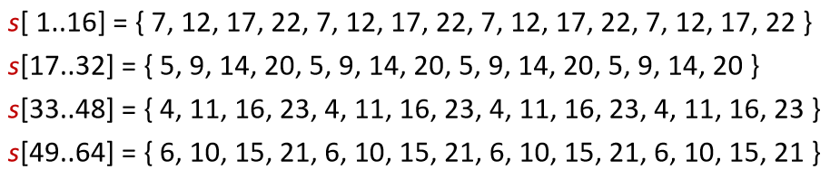

#### Output 

上述操作完成之后，缓冲区所保存的（a，b，c，d）就是我们所需要的结果。

算法结束时，对32位寄存器A的值按照little-endian转换成4个字节 ，顺序输出其8个16进制数符号；同样分别处理寄存器B, C, D，输出 MD5 值的其他24个16进制数符号。寄存器A, B, C, D联合输出的结果是32个16进制数符号(每个16进制数符号占4 bits，共128 bits)。

## Source code

> 更加具体的代码**在附件中给出**

### 利用string和bitset实现

- 因为我们的输入是任意长度的的，所以我们使用string来读取输入
- 因为涉及很多位的与或异或操作，所以使用bitset

具体流程：

1. 将读取到的string转为对应的bit串
2. 然后将转化的bit串填充标识/长度
3. 分块，将每块按little-endian重新排列，进行迭代
4. 输出结果：将每一缓冲区的little-endian转换回来，再拼在一起，转换为16进制输出

具体的类定义以及声明

由于我们再迭代过程中有4个轮函数，为了代码的简便，我们使用==函数数组==来存储它们

```c++
#pragma once
#include<string>
#include<bitset>

using std::string;
using std::bitset;

class MD5 {
private:
	bitset<32>IV[4] = { 0x67452301,0xefcdab89,0x98badcfe,0x10325476 };
	bitset<32>MD[4];
	
	//MD5 encryption related
	static bitset<32>(*fistleFunc[4])(bitset<32>, bitset<32>, bitset<32>);
	static unsigned int table_int[64];
	static int leftShift[16];
	static int X[64];
	static inline bitset<32> functionF(bitset<32>b, bitset<32>c, bitset<32>d);
	static inline bitset<32> functionG(bitset<32>b, bitset<32>c, bitset<32>d);
	static inline bitset<32> functionH(bitset<32>b, bitset<32>c, bitset<32>d);
	static inline bitset<32> functionI(bitset<32>b, bitset<32>c, bitset<32>d);
	static inline bitset<32> loopLeftShift(bitset<32>input,int n);
	
	//radix and character position related
	static string dec264bitsbin(int input);
	static string string2bit(string &plain);
	static string littleEndian(string input);
	static string deLittleEndian(bitset<32> &input);
	static string bits2hex(string &input);

	void chunkProcess(string &chunk);
	void padding(string &input);
	void transform(string plain);
public:
	explicit MD5(string plain);
	string getCipher();
};
```

按little-endian（便于MD5处理）排列以及Big-Endian（更符合我们的输入和输出习惯）排列

```c++
string MD5::littleEndian(string input) {
	return input.substr(24, 8) + input.substr(16, 8) + input.substr(8, 8) + input.substr(0, 8);
}

string MD5::deLittleEndian(bitset<32>&input) {
	string temp = input.to_string();
	return temp.substr(24, 8) + temp.substr(16, 8) + temp.substr(8, 8) + temp.substr(0, 8);
}
```

填充标识和长度

```c++
void MD5::padding(string &input) {
	string fill = "1";
	int origin_len = input.length();
    
    //Calculate the length required to fill ‘0’
	int len = (input.length() % 512 - 448);
	len = (len >= 0) ? 512 - len : -len;
	for (int i = 1; i < len; i++) {
		fill += "0";
	}
    
    //Fill in the "10..." string and the original string bit length in little endian order
	input += fill + dec264bitsbin(origin_len);
}
```

块的迭代函数处理

后面发现需要模2<sup>32</sup>的加法，但是bitset是没有这样的运算符，所以我们需要先通过to_ulong()转成unsigned long之后再做加法

```c++
void MD5::chunkProcess(string &trunk)
{
	bitset<32> Message[16];
	for (int i = 0; i < 16; i++) {
		Message[i] = bitset<32>(MD5::littleEndian(trunk.substr(32 * i, 32)));
	}
	
    //Iterative operation
	bitset<32>MD[4] = { IV[0] ,IV[1] ,IV[2] ,IV[3] };
	for (int i = 0; i < 64; i++) {
        //Fixed different generation functions for each round of loop
		bitset<32> fistleRes = MD5::fistleFunc[i / 16](MD[1], MD[2], MD[3]);
        
        //Combine the specified T table element with the different part of the message group
		bitset<32> tempRes = (fistleRes.to_ulong() + MD[0].to_ulong() + Message[MD5::X[i]].to_ulong() + MD5::table_int[i])&0xffffffff;

		MD[0] = MD[3];
		MD[3] = MD[2];
		MD[2] = MD[1];
		MD[1] = MD[1].to_ulong() + MD5::loopLeftShift(tempRes, MD5::leftShift[4*(i/16)+(i%16)%4]).to_ulong();
	}

	IV[0] = (unsigned int)MD[0].to_ulong() + (unsigned int)IV[0].to_ulong();
	IV[1] = (unsigned int)MD[1].to_ulong() + (unsigned int)IV[1].to_ulong();
	IV[2] = (unsigned int)MD[2].to_ulong() + (unsigned int)IV[2].to_ulong();
	IV[3] = (unsigned int)MD[3].to_ulong() + (unsigned int)IV[3].to_ulong();

}
```

### 利用string和cstdint实现

- 因为我们的输入是任意长度的的，所以我们使用string来读取输入
- 因为我们涉及到模加法运算，而且很多字节（Littile-endian）操作，所以使用uint8_t，uint16_t，uint32_t……

具体流程：

- 将读取的string转为char再转为uint8_t，填充到大小为512bits的buffer中，一旦buffer满了马上对它进行迭代处理
- 将需要padding的“10……”和原消息位长度填充到buffer中一旦buffer满了马上对它进行迭代处理
- 通过std::cout << std::hex将最后的结果以十六进制输出

具体的类声明和定义

```c++
#pragma once
#pragma once

#include<cstdint>
#include<string>

using std::string;

#define BLOCKSIZE (512 / 8)

class MD5 {
private:
	uint32_t IV[4] = { 0x67452301,0xefcdab89,0x98badcfe,0x10325476 };
	uint32_t MD[4];

	//MD5 encryption related
	static uint32_t(*fistleFunc[4])(uint32_t, uint32_t, uint32_t);
	static uint32_t table_int[64];
	static int leftShift[16];
	static int X[64];
	static inline uint32_t functionF(uint32_t b, uint32_t c, uint32_t d);
	static inline uint32_t functionG(uint32_t b, uint32_t c, uint32_t d);
	static inline uint32_t functionH(uint32_t b, uint32_t c, uint32_t d);
	static inline uint32_t functionI(uint32_t b, uint32_t c, uint32_t d);
	static inline uint32_t loopLeftShift(uint32_t input, int n);

	//radix and character position related
	static void littleEndian(uint32_t output[], uint8_t input[], int size);
	static void deLittleEndian(uint8_t output[], uint32_t input[], int size);

	void chunkProcess(uint8_t trunk[]);
	void padding(uint32_t len[2]);
	void transform(string plain);
	void fillAndEncrypt(uint8_t plain[], unsigned int len);

	uint8_t buffer[BLOCKSIZE] = { '0' };//Record the last not aligned block
	uint64_t messageLen;
public:
	explicit MD5(string plain);
	void getCipher();
};
```

按little-endian（便于MD5处理）排列以及Big-Endian（更符合我们的输入和输出习惯）排列

```c++
//Associated with radix
void MD5::littleEndian(uint32_t output[],uint8_t input[],int size) {
	for (int i = 0, j = 0; i < size; i += 4,j++) {
		output[j] = ((uint32_t)input[i] | (uint32_t)input[i + 1] << 8 | (uint32_t)input[i + 2] << 16 | (uint32_t)input[i + 3] << 24);
	}
}

void MD5::deLittleEndian(uint8_t output[],uint32_t input[],int size) {
	for (int i = 0, j = 0; i < size; i++, j += 4) {
		output[j] = input[i] & 0xff;
		output[j + 1] = (input[i] >> 8) & 0xff;
		output[j + 2] = (input[i] >> 16) & 0xff;
		output[j + 3] = (input[i] >> 24) & 0xff;
	}
}
```

边填充数据到buffer边检验是否需要将当前缓冲区加密

```c++
void MD5::fillAndEncrypt(uint8_t plain[], unsigned int len){
	unsigned int curPos = messageLen / 8 % BLOCKSIZE;
	unsigned int firstToFill = BLOCKSIZE - curPos;
	unsigned int copyLen = 0;

	messageLen += len << 3;
	
    //If the length exceeds the gap in the current buffer
	if (len >= firstToFill) {
		for (int i = curPos,j=0; i < BLOCKSIZE; i++,j++) {
			buffer[i] = plain[j];
			copyLen++;
		}
		chunkProcess(buffer);
		curPos = 0;
		
		for (int i = firstToFill; i + BLOCKSIZE <= len; i+=BLOCKSIZE) {
			chunkProcess(&plain[i]);
			copyLen += BLOCKSIZE;
		}
	}

	for (unsigned int i = curPos, j = copyLen; j < len; i++, j++) {
		buffer[i] = plain[j];
	}
}
```

填充‘10……’和长度

```c++
void MD5::padding(uint32_t len[2]) {
	static uint8_t paddingTable[64] = {
		0x80, 0, 0, 0, 0, 0, 0, 0, 0, 0, 0, 0, 0, 0, 0, 0, 0, 0, 0, 0, 0, 0,
		0, 0, 0, 0, 0, 0, 0, 0, 0, 0, 0, 0, 0, 0, 0, 0, 0, 0, 0, 0, 0, 0, 0,
		0, 0, 0, 0, 0, 0, 0, 0, 0, 0, 0, 0, 0, 0, 0, 0, 0, 0, 0
	};

	uint8_t lenBits[64] = { '0' };
	deLittleEndian(lenBits, len, 2);

	unsigned int padLen = (len[0] % 512);
	padLen = (padLen < 448) ? (448 - padLen) : (448 + 512 - padLen);
	fillAndEncrypt(paddingTable, padLen / 8);
	fillAndEncrypt(lenBits, 64);

}
```

块的迭代函数处理

```c++
void MD5::chunkProcess(uint8_t trunk[])
{
	uint32_t  Message[16];
	MD5::littleEndian(Message, trunk, BLOCKSIZE);

	uint32_t MD[4] = { IV[0] ,IV[1] ,IV[2] ,IV[3] };
	for (int i = 0; i < 64; i++) {
		uint32_t  fistleRes = MD5::fistleFunc[i / 16](MD[1], MD[2], MD[3]);
		uint32_t  tempRes = fistleRes + MD[0] + Message[MD5::X[i]] + MD5::table_int[i];

		MD[0] = MD[3];
		MD[3] = MD[2];
		MD[2] = MD[1];
		MD[1] = MD[1] + MD5::loopLeftShift(tempRes, MD5::leftShift[4 * (i / 16) + (i % 16) % 4]);
	}

	IV[0] = MD[0] + IV[0];
	IV[1] = MD[1] + IV[1];
	IV[2] = MD[2] + IV[2];
	IV[3] = MD[3] + IV[3];

}
```

### 运行结果

- 运行方法

  main函数通过

  ```c++
  getline(cin, input);
  cout << MD5(input).getCipher() << endl;
  ```

  从控制台读取字符串加密后输出

  由于输出结果时没有设置暂停，所以可以通过==重定向输出到文本文件中==查看结果

- 根据Wikipedia上的例子

  ```
  MD5("The quick brown fox jumps over the lazy dog") =
  9e107d9d372bb6826bd81d3542a419d6
  
  MD5("The quick brown fox jumps over the lazy dog.") = 
  e4d909c290d0fb1ca068ffaddf22cbd0
  
  MD5("") = 
  d41d8cd98f00b204e9800998ecf8427e
  ```

- 根据自己寻找的一个长字符串

  ```
  The MD5 algorithm is specified for messages consisting of any number of bits; it is not limited to multiples of eight bits (octets, bytes). Some MD5 implementations such as md5sum might be limited to octets, or they might not support streaming for messages of an initially undetermined length.
  ```

  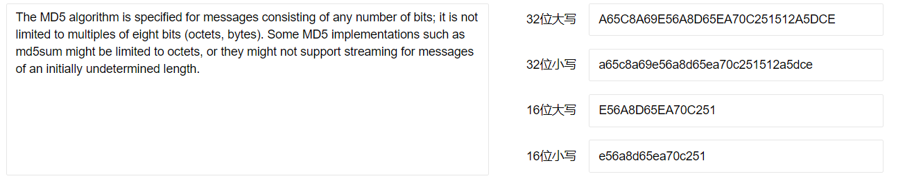

bitset版本的MD5：

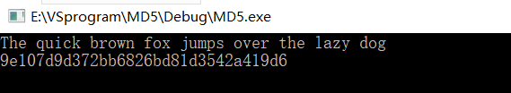

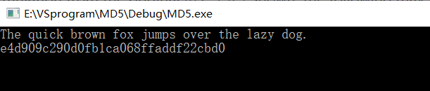

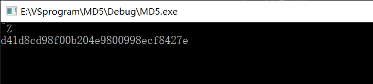

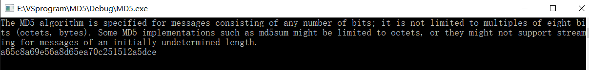

cstdint版本的MD5:

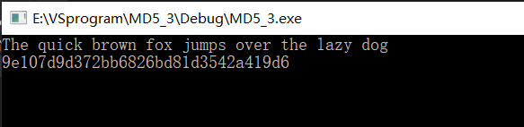

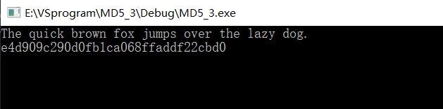

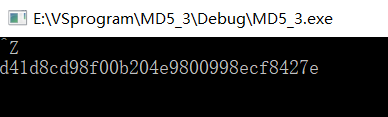

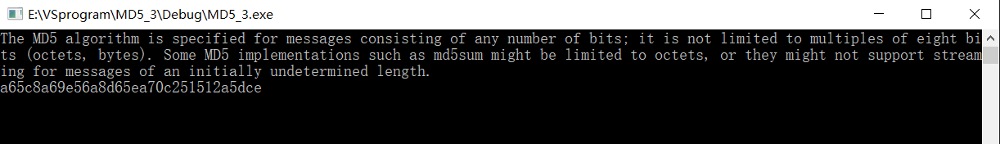