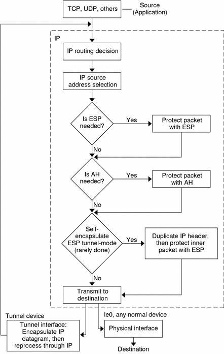
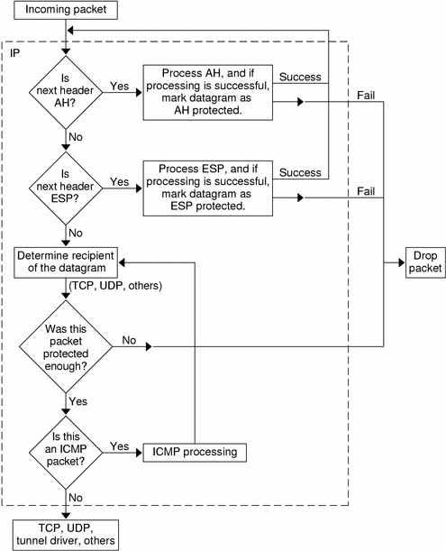
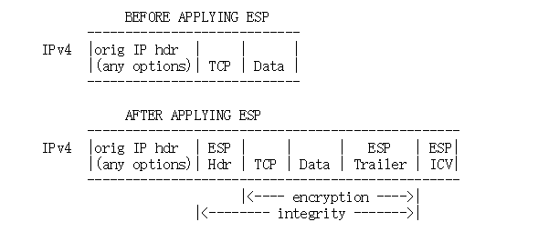
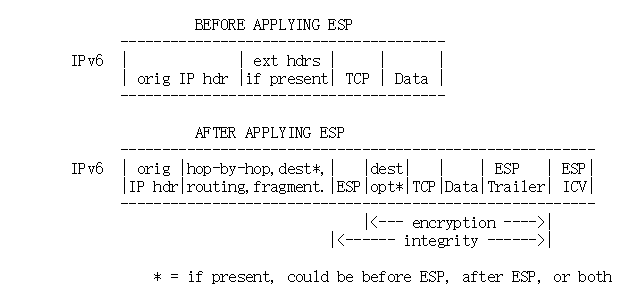
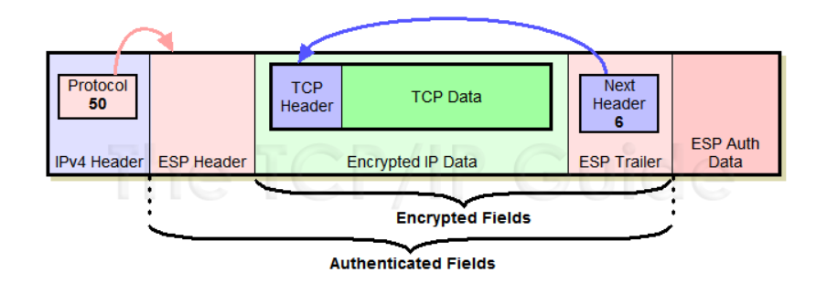
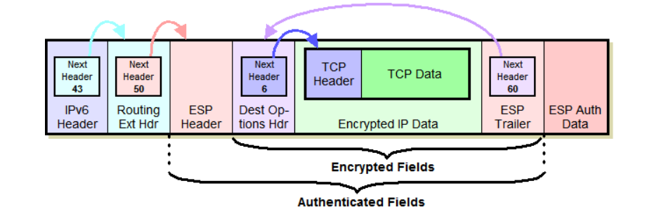
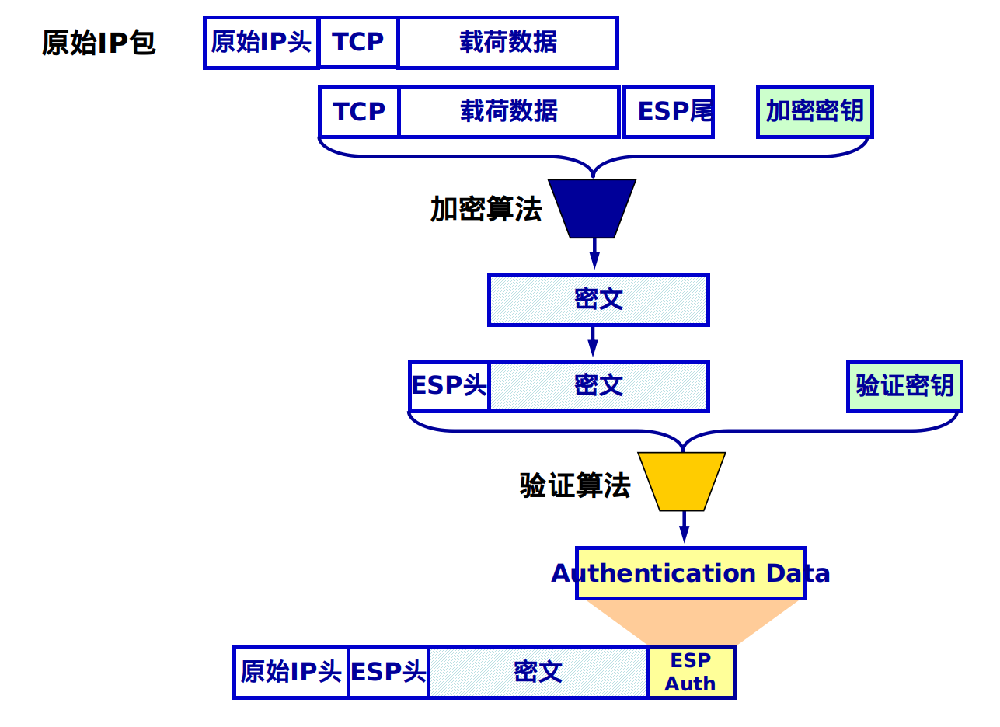

# IPsec

[toc]

## Introduction

> **Internet Protocol Security** (**IPsec**) 是一个安全的网络协议套件，它对数据包进行身份验证和加密，从而在Internet协议网络上的两台计算机之间提供安全的加密通信。它用于虚拟专用网(VPNs)
>
> IPsec包括用于在会话开始时建立代理之间的相互身份验证和会话期间使用的密钥协商的协议。IPsec可以保护一对主机(主机到主机)、一对安全网关(网络到网络)或安全网关和主机(网络到主机)之间的数据流。IPsec使用加密安全服务来保护Internet协议(IP)网络上的通信。它支持网络级的对等身份验证、数据源身份验证、数据完整性、数据机密性(加密)和重放保护。
>
> 最初的IPv4套件是在几乎没有安全保障的情况下开发的。IPv4增强的一部分,IPsec是第三层OSI模型或互联网端到端安全层方案,而其他一些广泛使用的互联网安全系统操作第三层以上,如传输层安全(TLS)和Secure Shell (SSH),这两个操作在传输层。IPsec可以在IP层自动保护应用程序。
>
> —— [IPsec Wikipedia](https://en.wikipedia.org/wiki/IPsec)

### Use of IPsec

- 加密应用层数据
- 为通过公共因特网发送路由数据的路由器提供安全性
- 要提供不加密的身份验证，例如验证数据来自已知的发送方
- 通过使用IPsec隧道设置电路来保护网络数据，其中所有数据在两个端点之间发送都是加密的，就像使用虚拟专用网(VPN)连接一样。

### Security architecture

- Authentication Header (AH)

  提供数据完整性，身份验证和防重播，并且不提供加密。防重放保护可防止未经授权的数据包传输。它不能保护数据的机密性。 

- Encapsulating Security Payload (ESP)

  它提供数据完整性，加密，身份验证和防重播。它还提供对有效负载的身份验证。

- Internet Key Exchange (IKE)

  它是一种网络安全协议，旨在动态交换加密密钥，并在两个设备之间找到一种安全关联(SA)。IKE提供了消息内容保护，并为实现标准算法(如SHA和MD5)提供了一个开放的框架。该算法的IP sec用户为每个数据包生成一个唯一的标识符。然后，这个标识符允许设备确定数据包是否正确。未经授权的信息包将被丢弃，且不交给接收者。

- Security Associations (SA)

  在两个网络实体之间建立共享的安全属性（例如算法和密钥），以支持安全通信。

### Modes of operation

- Tunnel Mode 隧道模式
  - 隧道模式下 IPsec 将要发送的原始 IP 报文作为数据内容，在这 段“数据”前面加上 ESP 或 AH 协议头，再加上新的 IP 头，形 成 IPsec 报文进行传输。
  - 原始 IP 报文的传输就像在一个安全的隧道中进行一样。在整个 传输过程中，原报文保持原有的完整结构，内容没有被修改。
- Transport Mode 传输模式
  - 传输模式下 IPsec 保护的仅仅是原始 IP 报文的数据内容部分 (即 IP 报文的有效载荷)，而不是整个原报文。在这个过程中原报文 结构被修改。
  - 在处理方法上，原 IP 报文被拆解，在其有效载荷前面加上新的 ESP 或 AH 协议头，再装回原来的 IP 地址，形成 IPsec 报文。

### Working

1. 主机检查是否应该使用IPsec传输数据包。 数据包流量会自行触发安全策略：

   - 发送数据包时系统应用了适当的加密
   - 检查传入的数据包是否正确加密。

2. IKE第1阶段：

   其中两个主机(使用IPsec)彼此进行身份验证，以启动一个安全通道。它有两种模式

   - main mode提供更强的安全性
   - aggressive mode使主机能够更快地建立IPsec电路

   通道用于安全地协商IP电路将加密数据穿过IP电路的方式

3. IKE第二阶段

   在安全通道上，两个主机协商会话上使用的密码算法的类型，并就这些算法使用的秘密密钥材料达成一致。

4. 通过新创建的IPsec加密隧道交换数据。主机使用IPsec SAs对这些包进行加密和解密

5. 当主机之间的通信完成或会话超时时，IPsec隧道将通过丢弃两个主机的密钥来终止

- ##### Outbound Packet Process

  

- ##### Inbound Packet Process

  

## Homework Solution

### Transport mode ESP encapsulation and decapsulation

> ==Header Location==
>
> In transport mode, ESP is inserted after the IP header and before a next layer protocol, e.g., TCP, UDP, ICMP, etc.  In the context of IPv4, this translates to placing ESP after the IP header (and any options that it contains), but before the next layer protocol.  (If AH is also applied to a packet, it is applied to the ESP header, Payload, ESP trailer, and ICV, if present.)
>
> 
>
> In the IPv6 context, ESP is viewed as an end-to-end payload, and thus   should appear after hop-by-hop, routing, and fragmentation extension   headers.  Destination options extension header(s) could appear   before, after, or both before and after the ESP header depending on   the semantics desired.  However, because ESP protects only fields   after the ESP header, it generally will be desirable to place the   destination options header(s) after the ESP header. 
>
> 
>
> —— [RFC 4303 section-3.1.1](https://tools.ietf.org/html/rfc4303#section-3.1.1)

#### Encapsulation

> 根据课上的PPT修改

1. 在原 IP 报文末尾添加 ESP trailer (尾部/挂载) 信息。

   ESP trailer 包含三部分。

   由于所选加密算法可能是块加密，当最后一块长度不足时就需要填充 (**padding**)

   附上填充长度 (**Pad length**) 方便解包时顺利找出用来填充的那一段数据。

   **Next header** 用来标明被封装的原报文的协议类型，例如 TCP = 6

2. 将原始IP数据报中的==原始TCP数据包（TCP Header + TCP Data）==和第一步中获得的==尾部信息整体==进行加密，以获得密文。具体的加密算法和密钥由SA给出。

3. 上一步获得的密文头需要添加ESP头。ESP头包括两部分：SPI和Seq＃。SPI是用于将IPSec数据与SA关联的安全参数索引。Seq＃用于保证数据报作为数据包标识符的唯一性。

4. 密文和ESP报头统称为“ enchilada”，它构成了身份验证部分。

5. 附加完整性度量结果 (ICV，Integrity check value)。对 “enchilada” 部分做认证，得到一个32位整数倍的完整性度量值 (消息认证码 MAC)，并附在 ESP 报文的尾部。完整性度量算法包括需要的认证密钥由 SA 给出

6. 将==原始IP数据报头的协议号更改为50==，以获取新的IP数据报头，表明该数据报文为ESP协议报文，然后将IP报文报头添加到第五步的结果中以形成传输方式

IPv4：

IPv6:

#### Decapsulation

1. 接收方接收IP数据包并确定数据包的协议类型。如果为50，则表示该报文被封装为ESP报文。下一步是根据解析ESP的规则来解析ESP包。
2. 首先查看ESP Header，获取ESP头的SPI安全参数索引号，并通过索引号查询SAD（安全关联数据库），以获取与数据包相对应的SA。
3. 解析SA数据。获取相应的IPSec方式和相关的安全规范。这里我们假设是==IPSec模式是传输模式==
4. 根据摘要算法和SA中的验证密钥，计算认证部分“ enchilada”的摘要值。与附加在IP消息末尾的完整性度量ICV进行比较。如果两者相同，则数据完整。
5. 检查Seq＃字段，以确定消息是否“新鲜”，以防止重放攻击。
6. 根据SA指定的加密算法和密钥对密文段进行解密，得到原始TCP报文和ESP Trailer。
7. 根据ESP Trailer的填充长度信息，找到填充字段的长度，并删除填充字段以获得原始TCP数据包。
8. 传递TCP数据包到传输层

总之，结构就是

## References

[IPSec Encapsulating Security Payload (ESP) ](http://www.tcpipguide.com/free/t_IPSecEncapsulatingSecurityPayloadESP-2.htm)

[Wikipedia IPsec](https://en.wikipedia.org/wiki/IPsec)

[RFC 4303](https://tools.ietf.org/html/rfc4303#page-22)